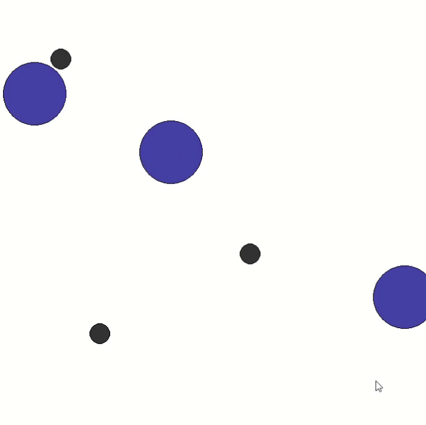
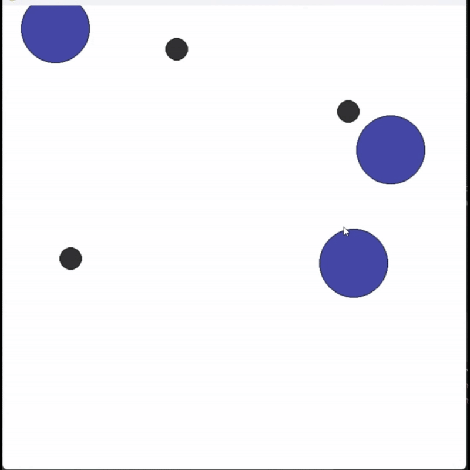

# imitation learning in multi-agent settings
Here we show how you could map a multi-agent pettingzoo environment to a gymnasium so we can imitate demonstrated behavior with GAIL.

<table>
  <tr>
    <td align="center"></td>
    <td align="center"></td>
  </tr>
  <tr>
    <td colspan="2" align="center">
      <em style="color: gray;">  On the left you see the expert swarm, trained with stable baselines PPO.
    On the right the imitation in new, unknown environments. 
    The goal of the environment is to minimize the distance from each obstacle (black) to any agent (blue).
    The learned strategy is to navigate one agent out of the way and place the other agents each inbetween two obstacles.</em>
    </td>
  </tr>
</table>

## Setup
This project is a PyCharm project. To import it to PyCharm, execute the following steps:
- press "get from Version Control"
- insert the url of this repository and clone
- install the requirements when you are asked to in the pop-up
- in the console, activate the virtual environment
- navigate to /sa_simple_spread
- pip install .

Otherwise: 
  - clone the project (git clone url)
  - prefarably create a virtual python environment and activate it
  - install the requirements (pip install -r requirements.txt)
  - navigate to /sa_simple_spread
  - pip install .

# Usage

To run the imitation process, execute python3 learn_in_sa_simple_spread.py
To visualise the generated policies, execute python3 jointpolicy_visu_pettingzoo.py

Currently, the trained policies are in github. You can train your own expert policies by 
removing the line 68 and uncomment line 67 in "learn_in_simple_spread". 

You can train your own GAIL by just deleting the desired gail_generator_X00k.zip file.

# Videos
To watch the recorded videos of the imitation process, navigate to /videos and download the mp4-files.  
